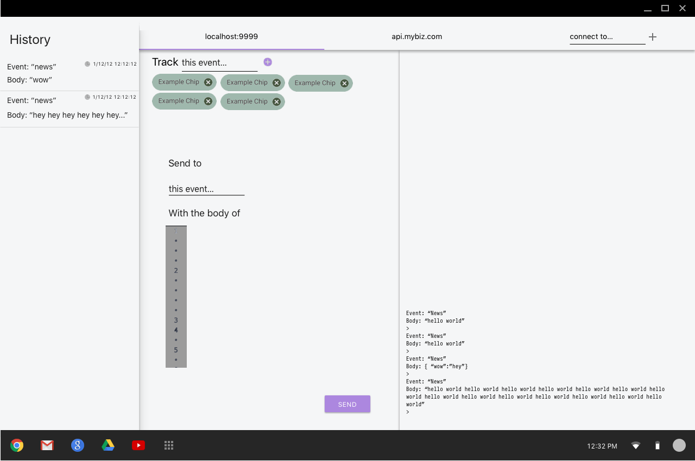
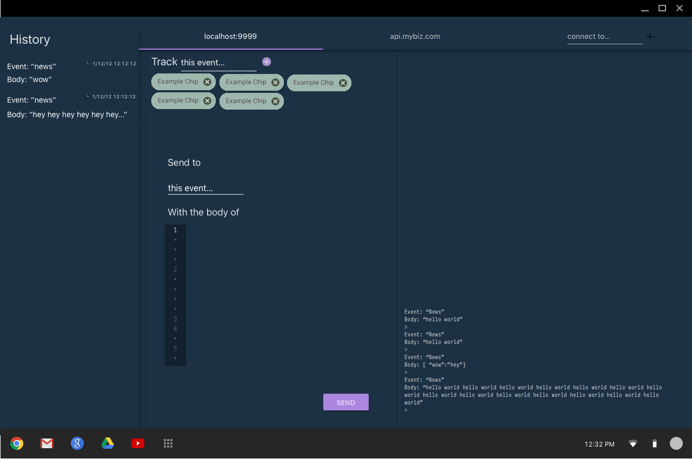

# It's coming...

a mockup...

Codename, "Project Lightning", will be a complete Socket.io test client allowing you to send and receive messages from your server in order to debug your applications.

## MVP Features
* Beautifully styled with Material Design guidelines
* Multiple connections
* Send events with complex bodies thanks to Ace Editor.
* History of sent messages
* Track any event
* Watch messages come in via terminal-like environment
* Multi-platform support thanks to Electron

### Dark theme
Oh yeah... also a slick dark theme.

a mockup...

## Roadmap and progress
The progress of this project will be kept on Trello [here](https://trello.com/b/ixMGRAL1/project-lightning).

## Getting Started

1. clone this repository
2. `cd project-lightning/`
3. `npm install`
4. `cd src/`
5. `npm install`
6. `cd ../`
7. `npm start`
